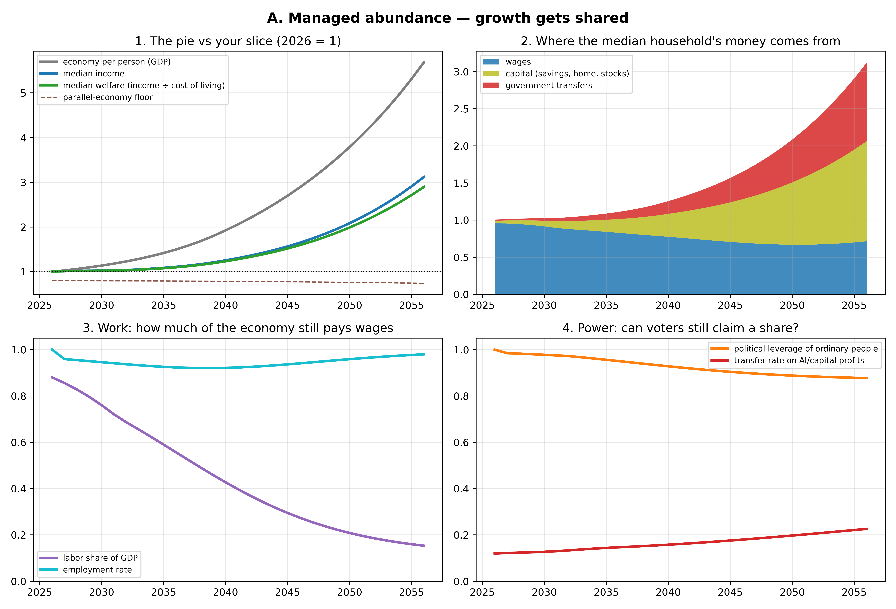
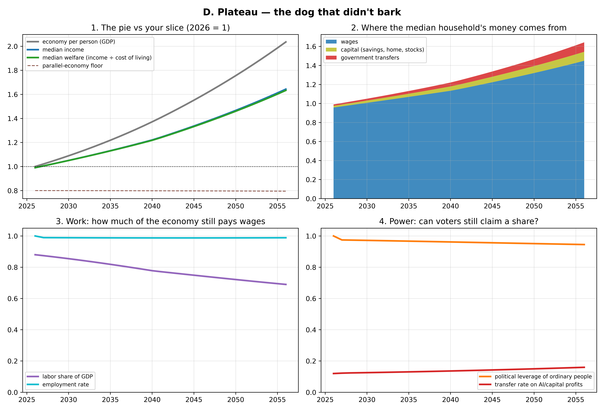

# Four futures: what might happen, and how you'd know which one you're in

*Built from the debiased 11-model survey (`survey2/`) and the calibrated simulator (`model/simulate_v2.py`). Each narrative is one of the scenario archetypes the surveyed models generated on their own; the probabilities are roughly where the panel put them. Graphs: `model/narrative_*.png`, regenerate with `uv run model/narratives.py`.*

**Two terms, once, so the graphs make sense.** *Labor share* = the fraction of all income in the economy that gets paid out as wages (it's been ~55–60% for a century — that stability is why working for a living has worked). *Transfers* = money the government sends you that you didn't earn from a job: benefits, tax credits, or a future "AI dividend."

**How to read every figure:** panel 1 compares the whole economy (gray) with the median person's income (blue) and their *welfare* — income divided by cost of living (green). The interesting thing is always the *gap* between gray and green. Panel 2 shows what the median household lives on. Panels 3 and 4 show the two slow variables that decide everything: how much of the economy still pays wages, and whether ordinary people retain the political muscle to claim a share once wages stop being the mechanism.

---

## A. Managed abundance — growth gets shared (~25%)

**The story.** AI makes the economy much more productive, and — this is the load-bearing part — institutions adapt *fast enough*. While workers still matter politically (late 2020s, early 2030s), governments lock in taxes on AI profits, citizen dividends, housing reform. Wages stop being the main way prosperity reaches people, but by the time that matters, two replacement pipes have been built: broader capital ownership and durable transfers.

**What the graph shows.** GDP grows ~6x by 2056 and the median person captures a real share of it: welfare roughly triples. Look at panel 2: wages (blue) shrink, but capital income (olive) and transfers (red) grow *before* wages give out — the handoff happens in time. Panel 4 is the tell: political leverage (orange) stays high, which is exactly what lets the transfer rate (red) climb without being clawed back.

**You would expect to see (signposts that this path is real):**
- 2026–2030: serious AI-rent taxation, sovereign wealth funds, or dividend legislation actually *passing* in major economies — not just being discussed.
- Labor share falls but then *stabilizes* (around 45–50%) instead of sliding indefinitely.
- Housing: permitting reform and automated construction visibly bending housing costs down — this is the single most falsifiable signpost, because housing is where shared abundance usually dies.
- After an initial dip, entry-level hiring recovers in *new* job categories (AI deployment, evals, care, retrofitting), and unemployment stays low.
- Transfer income on ordinary tax returns grows steadily, and the programs are *universal* (everyone gets them) rather than means-tested — universal programs are politically hard to take away.

**What would kill this story:** transfer bills repeatedly dying in legislatures while AI-lobby spending explodes; housing costs still outrunning incomes by 2032.

---

## B. Institutional lag — the squeeze (~35%, the most likely single path)

**The story.** This is the boring, grinding version, and both the panel and the simulator make it the modal outcome. AI works. The economy grows nicely. And the median person mostly... watches. Wage gains concentrate among the minority whose skills complement AI; everyone else cycles through restructured jobs. Governments do respond — but reactively, slowly, each program five years late and 30% too small. Nobody starves. Nothing collapses. The median person in 2046 is roughly where they started materially, *much* richer in digital things, poorer in security, mobility, and say.

**What the graph shows.** The scissors in panel 1: the economy more than triples while median welfare crawls to maybe +10–20%. That widening gray-green gap *is* this scenario — growth without sharing, but also without catastrophe. Panel 2: wages shrink toward half of household income; transfers grow, but compare the red wedge here to scenario A's — too little, too late. Panel 4: leverage erodes to ~half, which is why the transfer rate plateaus instead of climbing.

**You would expect to see:**
- Entry-level white-collar hiring (including junior software roles) stays depressed for years while GDP and corporate margins set records — the single clearest early signature, and partially visible already.
- Labor share of GDP sliding ~0.5–1 point per year with no floor in sight.
- "Everything is cheap except the things you need": electronics, software, entertainment, tutoring get dramatically cheaper while housing, insurance, healthcare, energy eat a growing share of the median budget.
- Redistribution arrives as patchwork — targeted credits, one-off rebates, means-tested programs — rather than durable universal claims.
- Politics gets angrier (populist surges on both flanks) without producing structural reform; trust-in-institutions polls keep falling.

**What would kill this story:** in the good direction, an A-style legislative breakthrough by ~2032; in the bad direction, transfers getting actively *rolled back* while top-wealth shares jump — that's the slide into C.

---

## C. Neo-feudal rentier — concentration wins (~20–25%)

**The story.** Same technology as A and B; different politics. Frontier AI and the resources it needs (compute, energy, land) end up controlled by a handful of firms. Their economic weight buys regulatory and media influence *before* counter-organizing happens, so attempts to tax the surplus fail — capital is mobile, legislatures are captured, persuasion is automated. Once labor has no market power and voters have no effective leverage, there's no mechanism forcing anyone to share, and transfers get cut back to pacification level. This is your original prior — the closest the evidence comes to it. Note what it *isn't*: mass starvation. It's dependence. Cheap entertainment, adequate calories, algorithmically allocated housing, no path up, no voice.

**What the graph shows.** The economy quadruples; median welfare *declines* to ~0.6 and lands on the dashed brown line — the parallel-economy floor, Metzger's "the displaced trade with each other," degraded by expensive land and energy. Panel 4 is the engine of the whole scenario: leverage (orange) collapses *first*, by the early 2030s — and then the transfer rate falls too, because nothing forces it up anymore. Compare with B, where leverage erodes halfway and transfers at least hold. The difference between B and C is not the technology. It's panel 4.

**You would expect to see:**
- Top-1% wealth share jumping several points within a few years (panel target: 51% chance of +10 points by 2046).
- Effective tax rates on AI profits *falling* while the firms' revenues explode; serious tax attempts dying via capital-flight threats or court challenges.
- Transfers turning conditional, surveilled, and means-tested — easy to cut quietly, scaled back after each fiscal "emergency."
- Frontier compute concentration staying above ~70% in a few firms; open models legally squeezed out (liability rules, compute licensing).
- AI-powered political persuasion normalized; election outcomes increasingly uncorrelated with polled policy preferences; protest movements that fizzle against automated counter-messaging.
- Growing informal/barter economy at the bottom, rising private security at the top.

**What would kill this story:** any durable universal claim on AI income surviving a hostile government transition (proves lock-in works); or open-weight models staying within ~2 years of frontier (caps the rent everyone fears).

---

## D. Plateau — the dog that didn't bark (~15–20%)

**The story.** The narrative nobody markets but every model kept ~15–25% probability on: AI improves, then stops mattering economically — reliability stalls on long tasks, robots stay expensive and clumsy, energy and regulation throttle the buildout. AI ends up like a very good spreadsheet: everywhere, useful, not transformative. The 2040s are dominated not by AI but by *demographics* — pensions, eldercare, debt, retirement at 69. Your job in 2046 looks like your job in 2026 with better autocomplete.

**What the graph shows.** All four panels are nearly flat. Labor share stays ~75% of its current value, employment stays high, leverage barely moves, welfare grinds up ~1%/year the old-fashioned way. Boring — and worth staring at, because *this is the only scenario where the labor share survives*, and it's also the ceiling on "nothing changes": even here the median person only gains ~40% over 20 years.

**You would expect to see:**
- By 2028–2031: AI agents still can't reliably complete multi-day, loosely specified work without supervision; enterprise deployments stuck in pilot purgatory; measured productivity growth stubbornly ~1.5% despite the hype.
- The capex bubble deflating: datacenter write-downs, chip-stock crash, AI startups folding — a dot-com-style correction *without* a later dot-com-style payoff.
- Wage structure and labor share basically unchanged year after year.
- Political headlines drifting back to aging, pensions, immigration, debt — AI fading from front pages.

**What would kill this story:** one demonstration of an AI system reliably running a week-long professional workflow end-to-end, or a general-purpose robot under ~$30k. Either restarts the clock on A/B/C.

---

## How to use these four pictures

The four futures *diverge from a common trunk*. Through ~2030, A, B, and C look almost identical from inside: growth up, labor share drifting down, transfers debated. The fork that matters is **panel 4** — whether durable, universal claims on AI income get locked in while ordinary people still have leverage. That's decided roughly 2028–2035, which is why it's also the highest-leverage period for both your personal hedging (convert income to assets while your wage is strong) and any political effort.

So the watchlist compresses to four numbers, checkable once a year:
1. **Labor share of GDP** — falling and *stabilizing* (A), falling steadily (B), falling fast (C), or flat (D)?
2. **Entry-level white-collar hiring** vs corporate margins — the scissors opening is the B/C signature.
3. **One legislative fact:** has any major economy passed a *universal* claim on AI profits that survived a change of government? Yes → A. Debated forever → B. Attempted and crushed → C.
4. **The frontier gap:** can an agent do a week of unsupervised professional work? No, year after year → D.

One honest caveat: all four graphs come from the same simple engine, tuned so its statistics match what 11 AI models collectively expect. That's a disciplined way to draw pictures of beliefs — it is not knowledge of the future. The probabilities are soft; the *shapes*, and the signposts that distinguish them, are the useful part.
