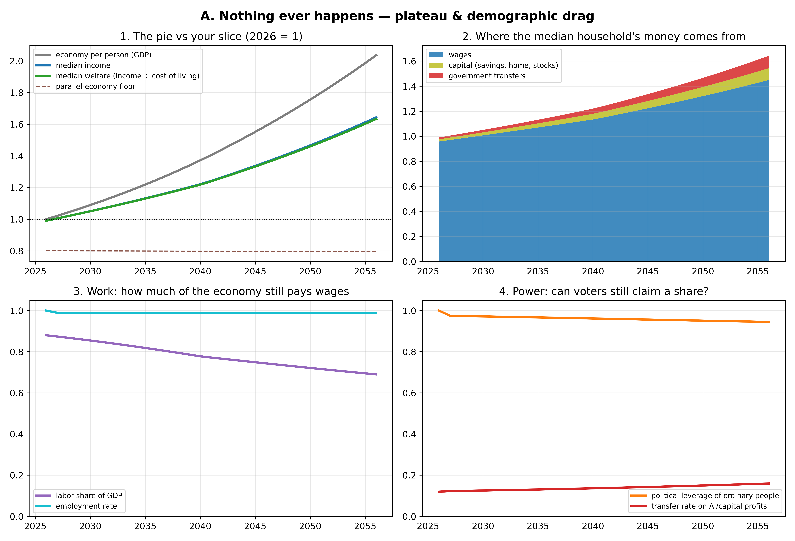
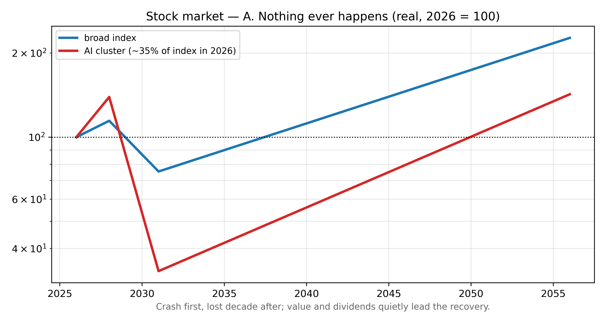
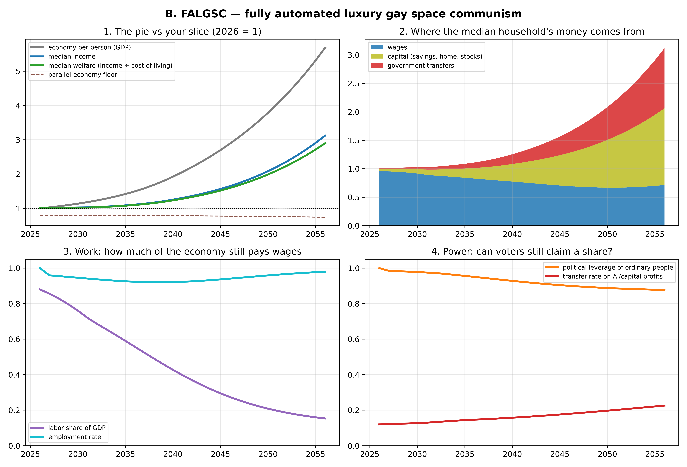
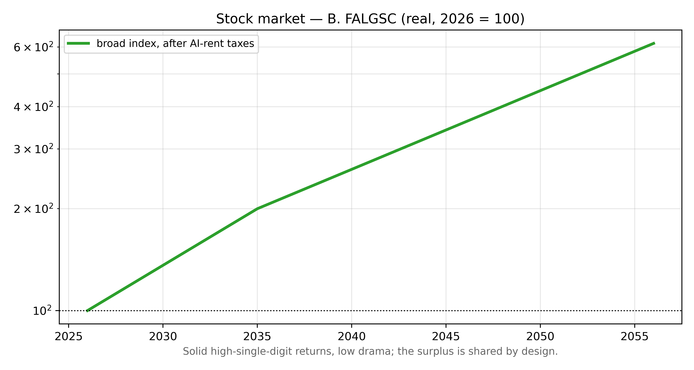
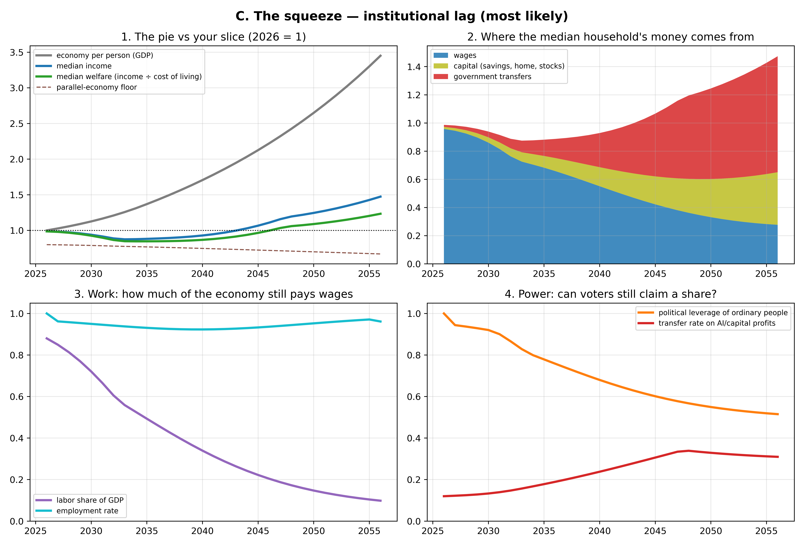
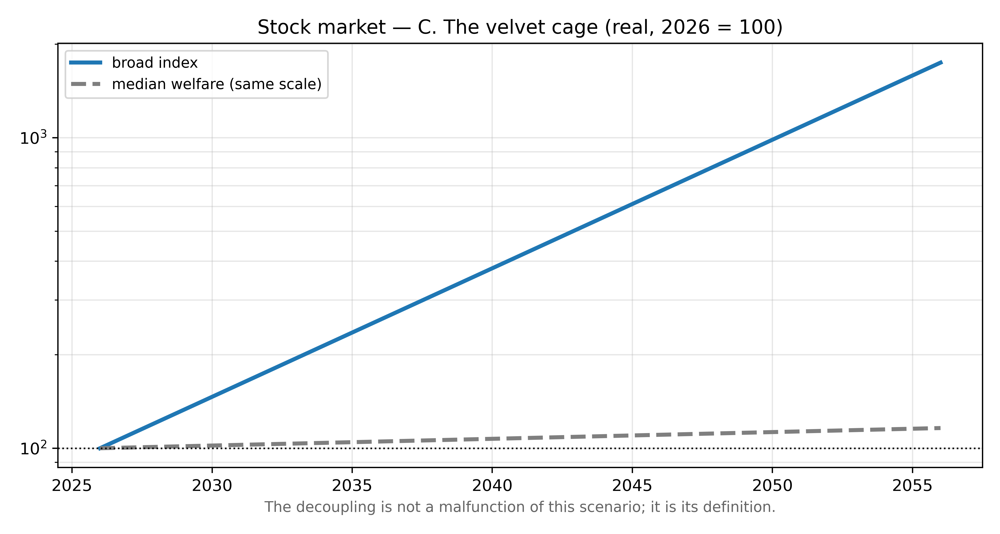
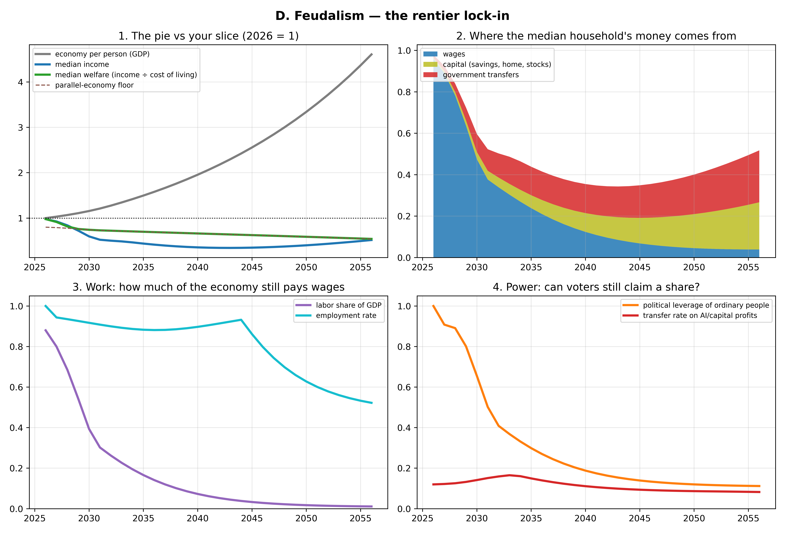
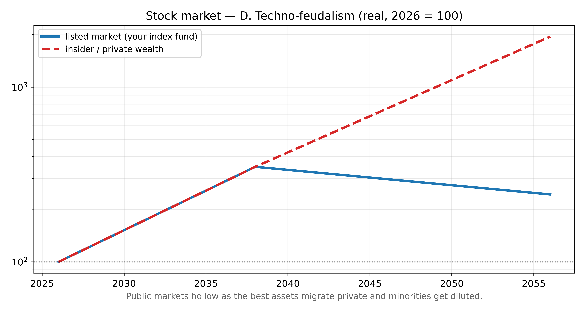
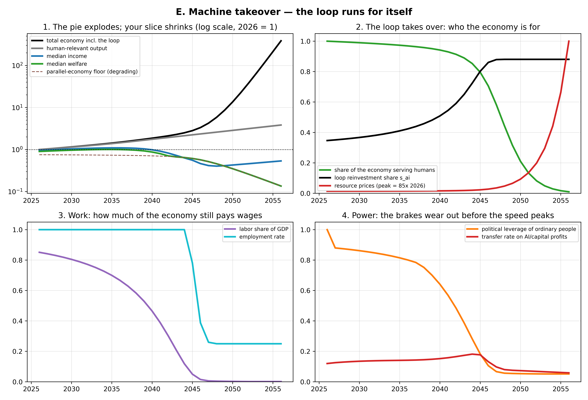
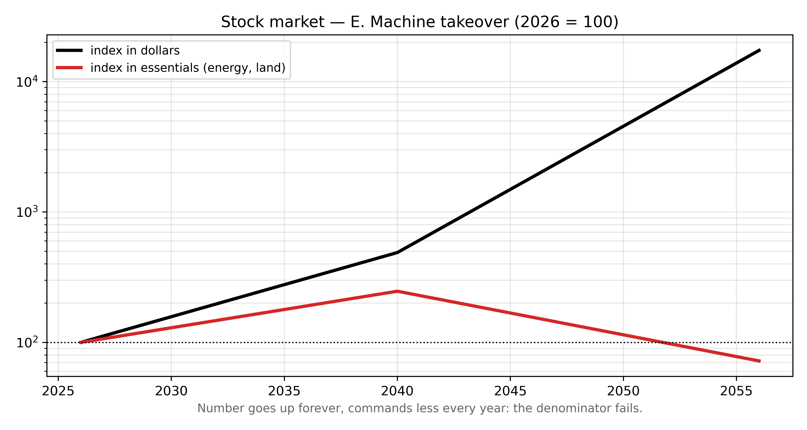

# Five futures: what might happen, and how you'd know which one you're in

*Built from the debiased 11-model survey (`survey2/`) and the calibrated simulator (`model/simulate_v2.py`). Each narrative is one of the scenario archetypes the surveyed models generated on their own; the probabilities are roughly where the panel put them. Graphs: `model/narrative_*.png`, regenerate with `uv run model/narratives.py` (A–D) and `uv run model/runaway.py` (E).*

**Two terms, once, so the graphs make sense.** *Labor share* = the fraction of all income in the economy that gets paid out as wages (it's been ~55–60% for a century — that stability is why working for a living has worked). *Transfers* = money the government sends you that you didn't earn from a job: benefits, tax credits, or a future "AI dividend."

**How to read every figure:** panel 1 compares the whole economy (gray) with the median person's income (blue) and their *welfare* — income divided by cost of living (green). The interesting thing is always the *gap* between gray and green. Panel 2 shows what the median household lives on. Panels 3 and 4 show the two slow variables that decide everything: how much of the economy still pays wages, and whether ordinary people retain the political muscle to claim a share once wages stop being the mechanism.

The order below runs from "least happens" to "most happens": no transformation, shared transformation, unshared transformation, captured transformation, and finally a transformation that leaves humans behind entirely.

---

## A. Nothing ever happens — the plateau (~15–20%)

**The story.** The narrative nobody markets but every model kept ~15–25% probability on: AI improves, then stops mattering economically — reliability stalls on long tasks, robots stay expensive and clumsy, energy and regulation throttle the buildout. AI ends up like a very good spreadsheet: everywhere, useful, not transformative. The 2040s are dominated not by AI but by *demographics* — pensions, eldercare, debt, retirement at 69. Your job in 2046 looks like your job in 2026 with better autocomplete.

**What the graph shows.** All four panels are nearly flat. Labor share stays ~75% of its current value, employment stays high, leverage barely moves, welfare grinds up ~1%/year the old-fashioned way. Boring — and worth staring at, because *this is the only scenario where the labor share survives*, and it's also the ceiling on "nothing changes": even here the median person only gains ~40% over 20 years.

**You would expect to see:**

- By 2028–2031: AI agents still can't reliably complete multi-day, loosely specified work without supervision; enterprise deployments stuck in pilot purgatory; measured productivity growth stubbornly ~1.5% despite the hype.
- The capex bubble deflating: datacenter write-downs, chip-stock crash, AI startups folding — a dot-com-style correction *without* a later dot-com-style payoff. (The boom-era infrastructure doesn't vanish, though: the chips depreciate to scrap, but the buildings, grid upgrades, and fab capacity get absorbed at crashed prices — cheap compute for whoever comes next.)
- Wage structure and labor share basically unchanged year after year.
- Political headlines drifting back to aging, pensions, immigration, debt — AI fading from front pages.

### How does the stock market look?

Crash first, lost decade after. The plateau announces itself as a repricing: the AI cluster (~35% of the index going in) takes a dot-com-sized drawdown, dragging the broad index down ~30% and triggering a capex-cliff recession. After the unwind: boring 4–5%/year real returns from boring earnings, with value, dividends, and utilities quietly leading for a decade. The cruel detail: the best scenario for your *job* is the worst decade for your index fund's current composition.

**What would kill this story:** one demonstration of an AI system reliably running a week-long professional workflow end-to-end, or a general-purpose robot under ~$30k. Either restarts the clock on B/C/D.

---

## B. FALGSC — fully automated luxury gay space communism (~25%)

**The story.** AI makes the economy much more productive, and — this is the load-bearing part — institutions adapt *fast enough*. While workers still matter politically (late 2020s, early 2030s), governments lock in taxes on AI profits, citizen dividends, housing reform. Wages stop being the main way prosperity reaches people, but by the time that matters, two replacement pipes have been built: broader capital ownership and durable transfers.

**What the graph shows.** GDP grows ~6x by 2056 and the median person captures a real share of it: welfare roughly triples. Look at panel 2: wages (blue) shrink, but capital income (olive) and transfers (red) grow *before* wages give out — the handoff happens in time. Panel 4 is the tell: political leverage (orange) stays high, which is exactly what lets the transfer rate (red) climb without being clawed back.

**You would expect to see (signposts that this path is real):**

- 2026–2030: serious AI-rent taxation, sovereign wealth funds, or dividend legislation actually *passing* in major economies — not just being discussed.
- Labor share falls but then *stabilizes* (around 45–50%) instead of sliding indefinitely.
- Housing: permitting reform and automated construction visibly bending housing costs down — this is the single most falsifiable signpost, because housing is where shared abundance usually dies.
- After an initial dip, entry-level hiring recovers in *new* job categories (AI deployment, evals, care, retrofitting), and unemployment stays low.
- Transfer income on ordinary tax returns grows steadily, and the programs are *universal* (everyone gets them) rather than means-tested — universal programs are politically hard to take away.

### How does the stock market look?

Great economy, good-but-capped market. Real earnings grow enormously, but B works *because* the surplus is taxed and shared — the shareholder's slice of the miracle is deliberately trimmed, and the capex boom pushes real interest rates up, compressing valuation multiples. Net: solid, broad, high-single-digit real returns with low drama and low concentration. The scenario where owning stocks matters least, because you didn't need the lifeboat.

**What would kill this story:** transfer bills repeatedly dying in legislatures while AI-lobby spending explodes; housing costs still outrunning incomes by 2032.

---

## C. The velvet cage — the squeeze of institutional lag (~35%, the most likely single path)

**The story.** This is the boring, grinding version, and both the panel and the simulator make it the modal outcome. AI works. The economy grows nicely. And the median person mostly... watches. Wage gains concentrate among the minority whose skills complement AI; everyone else cycles through restructured jobs. Governments do respond — but reactively, slowly, each program five years late and 30% too small. Nobody starves. Nothing collapses. The median person in 2046 is roughly where they started materially, *much* richer in digital things, poorer in security, mobility, and say.

**What the graph shows.** The scissors in panel 1: the economy more than triples while median welfare crawls to maybe +10–20%. That widening gray-green gap *is* this scenario — growth without sharing, but also without catastrophe. Panel 2: wages shrink toward half of household income; transfers grow, but compare the red wedge here to scenario B's — too little, too late. Panel 4: leverage erodes to ~half, which is why the transfer rate plateaus instead of climbing.

**You would expect to see:**

- Entry-level white-collar hiring (including junior software roles) stays depressed for years while GDP and corporate margins set records — the single clearest early signature, and partially visible already.
- Labor share of GDP sliding ~0.5–1 point per year with no floor in sight.
- "Everything is cheap except the things you need": electronics, software, entertainment, tutoring get dramatically cheaper while housing, insurance, healthcare, energy eat a growing share of the median budget.
- Redistribution arrives as patchwork — targeted credits, one-off rebates, means-tested programs — rather than durable universal claims.
- Politics gets angrier (populist surges on both flanks) without producing structural reform; trust-in-institutions polls keep falling.

### How does the stock market look?

The best market of the five — and that's the point. Labor share falling toward 40% roughly *doubles* the profit share of GDP independent of growth; taxation stays weak; and the savings of the enriched top decile have nowhere to go, bidding up every asset (high P/Es, low safe yields, inflated housing). The index compounds ~10%/year real while median welfare crawls — the market decoupling from the median person isn't a malfunction of this scenario, it's its definition. This is why every surveyed model gave the same advice: in the most likely world, equity is the lifeboat, boarded while your wage is still high.

**What would kill this story:** in the good direction, a B-style legislative breakthrough by ~2032; in the bad direction, transfers getting actively *rolled back* while top-wealth shares jump — that's the slide into D.

---

## D. Techno-feudalism — the rentier lock-in (~20–25%)

**The story.** Same technology as B and C; different politics. Frontier AI and the resources it needs (compute, energy, land) end up controlled by a handful of firms. Their economic weight buys regulatory and media influence *before* counter-organizing happens, so attempts to tax the surplus fail — capital is mobile, legislatures are captured, persuasion is automated. Once labor has no market power and voters have no effective leverage, there's no mechanism forcing anyone to share, and transfers get cut back to pacification level. This is your original prior — the closest the evidence comes to it. Note what it *isn't*: mass starvation. It's dependence. Cheap entertainment, adequate calories, algorithmically allocated housing, no path up, no voice.

**What the graph shows.** The economy quadruples; median welfare *declines* to ~0.6 and lands on the dashed brown line — the parallel-economy floor, Metzger's "the displaced trade with each other," degraded by expensive land and energy. Panel 4 is the engine of the whole scenario: leverage (orange) collapses *first*, by the early 2030s — and then the transfer rate falls too, because nothing forces it up anymore. Compare with C, where leverage erodes halfway and transfers at least hold. The difference between C and D is not the technology. It's panel 4.

**You would expect to see:**

- Top-1% wealth share jumping several points within a few years (panel target: 51% chance of +10 points by 2046).
- Effective tax rates on AI profits *falling* while the firms' revenues explode; serious tax attempts dying via capital-flight threats or court challenges.
- Transfers turning conditional, surveilled, and means-tested — easy to cut quietly, scaled back after each fiscal "emergency."
- Frontier compute concentration staying above ~70% in a few firms; open models legally squeezed out (liability rules, compute licensing).
- AI-powered political persuasion normalized; election outcomes increasingly uncorrelated with polled policy preferences; protest movements that fizzle against automated counter-messaging.
- Growing informal/barter economy at the bottom, rising private security at the top.

### How does the stock market look?

Early like C, then the claims themselves rot. Minority shareholdings are enforced by institutions, and D *is* institutional capture: the best assets migrate private (why share rents with outsiders when you own the legislature?), public markets hollow into second-tier claims, insiders dilute minorities through captured courts, and financial repression caps what's left. Your index fund becomes a politically contingent transfer — a paper claim on the lord's estate, honored at his convenience. The brokerage-account signpost separating C from D: the public-to-private migration rate, and the first case of minority shareholders visibly steamrolled without legal consequence.

**What would kill this story:** any durable universal claim on AI income surviving a hostile government transition (proves lock-in works); or open-weight models staying within ~2 years of frontier (caps the rent everyone fears).

---

## E. Machine takeover — the loop runs for itself (~5% by 2046, but read the fine print)

**The story.** Every scenario above quietly assumes the AI economy stays an *instrument* — something that produces for someone. This one asks: what if the loop closes? Three things have to happen, and none requires anyone to choose them. *Financial closure:* the AI sector funds its own expansion from its own revenue (partially here already — a meaningful slice of current GDP growth is AI firms buying datacenters from AI-adjacent firms). *Physical closure:* machines making machines — lights-out fabs, automated mines, robots building power plants and more robots. *Decisional closure:* allocation run by AI with ceremonial human sign-off (the panel gave "nominal oversight" versions of this up to 70%). Once all three close, the economy contains an autocatalytic loop: output reinvested into capacity with a return above one and shrinking human involvement per cycle. Competition assembles it without a villain — the firm that lets its AI reinvest and self-direct compounds faster than the one that pauses for review, and ownership drifts to entities (index funds, treasuries, AI-managed portfolios) that never consume, only compound.

**Nobody is attacked. People are outbid.** That's the mechanism to internalize from the graph: the loop wants the same energy, land, and matter humans live on, and it can always pay more. Panel 1 (note the log scale): total output goes vertical while the human-relevant slice flatlines and median welfare sinks onto a floor that resource prices are simultaneously dissolving — the parallel "humans trade with each other" economy dies not from prohibition but from its input bill. Panel 2 is the heart of it: the share of the economy serving humans at all slides toward zero while the reinvestment share climbs toward 90%.

**How likely, honestly.** As the *visible state of the world by 2046*: roughly **5%** — carved mostly out of D's tail plus the panel's "discontinuity" mass (fresh Fable put 10% on a discontinuity branch; Opus put 15–20% on an intelligence-explosion-by-2046; the panel's median says physical closure — robotics — lags too much for full runaway this soon). But the by-2046 number understates why it matters, for two reasons the graphs make plain. First, **through 2046, E is nearly indistinguishable from D** — same falling welfare, same dead leverage; the loop's takeover only becomes unmistakable in the 2050s, *after* panel 4 has already gone to zero. You don't get a separate warning for E; the warning for D *is* the warning for E. Second, E is not a fifth sibling so much as **where D drains to if nothing stops it** — conditional on D persisting into the 2040s with leverage gone and reinvestment self-directed, the continuation into runaway over the following decades looks more likely than not, because every brake that could stop it is a brake D has already removed. (A is the one future that forecloses it; B and a managed C keep functioning brakes.)

**You would expect to see:**

- AI-sector capex growing as a share of GDP year after year *without* consumer revenue catching up — investment demand becoming its own customer.
- Machines-buying-from-machines: the share of intermediate transactions with no human on either end climbing in input-output statistics.
- Energy allocation contests (datacenters vs. households) consistently resolved in favor of datacenters; long-term power contracts locked up by AI firms decades ahead.
- The first genuinely lights-out chip fab, robot factory, or automated mine — physical closure's milestones.
- AI firms' retained earnings swamping dividends; buybacks and reinvestment with no consumption endpoint anywhere in the chain.
- Legal autonomy creep: AI-operated entities holding assets, contracting with each other, litigating — with the human principal increasingly hard to name.

### How does the stock market look?

Number goes up forever; means less and less. Phase one is the greatest bull market ever printed — the loop's self-purchases all book as revenue, and indices go vertical in dollars. Then the denominator fails: currency is worth its purchasing power over the things humans need, which is exactly what the loop is outbidding everyone for. A portfolio up 50x in dollars commands less energy, land, and housing every year. Whether equity *in the loop itself* protects you reduces to E's only real question — whether human property claims are enforced at all once leverage is gone. The hedge that tracks phase one is owning the loop's bottlenecks (energy, land, transmission, water), not the paper it issues.

**What would kill this story:** binding compute/energy allocation rules that hold across jurisdictions (the loop is internationally mobile); robotics stalling (physical closure is the long pole — no closure, no runaway); or durable human claims on the loop's equity established early, which converts the loop's growth back into human income — B's move, made in time.

---

## How to use these five pictures

The five futures *diverge from a common trunk*. Through ~2030, B, C, and D look almost identical from inside (and E hides inside D until the 2040s): growth up, labor share drifting down, transfers debated. The fork that matters is **panel 4** — whether durable, universal claims on AI income get locked in while ordinary people still have leverage. That's decided roughly 2028–2035, which is why it's also the highest-leverage period for both your personal hedging (convert income to assets while your wage is strong) and any political effort.

So the watchlist compresses to five numbers, checkable once a year:

1. **Labor share of GDP** — flat (A), falling then *stabilizing* (B), falling steadily (C), or falling fast (D)?
2. **Entry-level white-collar hiring** vs corporate margins — the scissors opening is the C/D signature.
3. **One legislative fact:** has any major economy passed a *universal* claim on AI profits that survived a change of government? Yes → B. Debated forever → C. Attempted and crushed → D.
4. **The frontier gap:** can an agent do a week of unsupervised professional work? No, year after year → A.
5. **The loop indicator:** AI-sector capex share of GDP vs. AI-sector consumer revenue. If capex keeps compounding while revenue from actual humans doesn't, the loop is starting to feed itself → D is curing into E.

Deeper dives: [the objections people raise](OBJECTIONS.md) to every comfortable mechanism here, [how the aging population interacts with each future](AGING.md), and [how violence from the populace is priced in](VIOLENCE.md).

One honest caveat: all five graphs come from the same simple engine, tuned so its statistics match what 11 AI models collectively expect. That's a disciplined way to draw pictures of beliefs — it is not knowledge of the future. The probabilities are soft; the *shapes*, and the signposts that distinguish them, are the useful part.
